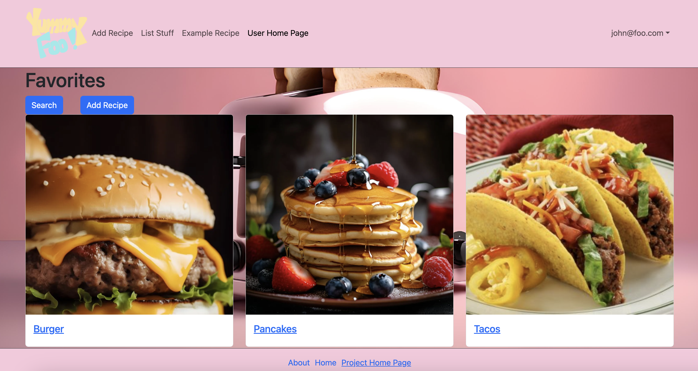
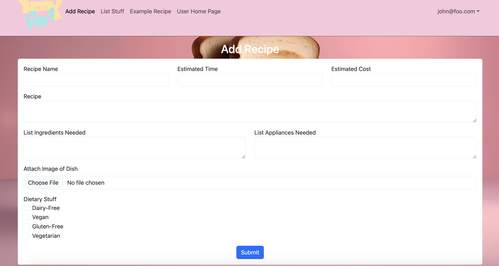
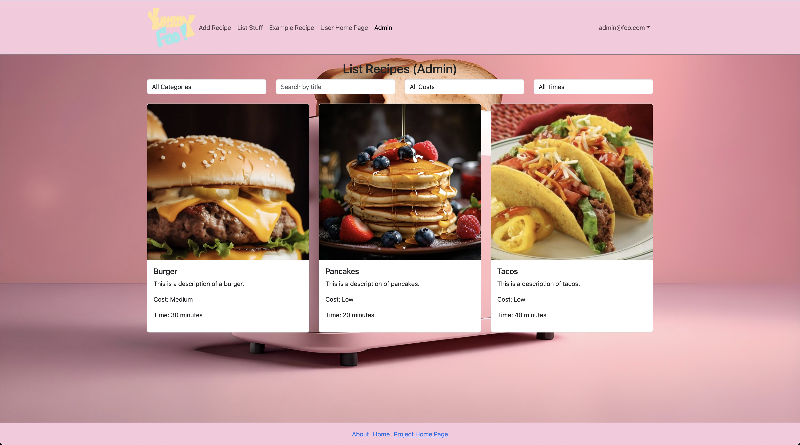

# Goal
Our goal for this project is to create an information hub where students of UH Manoa can find, share and learn new and creative recipes that will fit within the budget of a college student. For convenience and money’s sake, the majority of students will buy fast food or take out for their meals. However, this can lead to unhealthy eating habits as well as a selection of food that might not fit the constraints of every student, whether that be food allergies or intolerances. 

To remedy this, our website will prompt UH students to begin or expand on their culinary education, learning how to cook up meals that will fit their specific needs. We hope that with the large selection of vendors, pricing information, ingredient convenience, as well as acknowledgement of dietary constrictions, this will be able to help all students of UH Manoa.

## Link To...
  * [Team Contract](https://docs.google.com/document/d/10fjiUGCcoZn1zsEntLvA_btXFST54v0s46QtEraBu4E/edit?usp=sharing)
  * [GitHub Organization](https://github.com/eat-sleep-fortnite-repeat/eat-sleep-fortnite-repeat.github.io)
  * [Milestone 1 Project Page](https://github.com/orgs/eat-sleep-fortnite-repeat/projects/2)
  * [Milestone 2 Project Page](https://github.com/orgs/eat-sleep-fortnite-repeat/projects/3)

## M1 Pages So Far

### Landing Page

### User Homepage 

### About Us Page

### Recipe Page

### Add Recipe Page

### List Recipes Admin Page

## Deployment
Find our project website [here](http://146.190.161.129/)!

## Development History
The development process for Yummy Foo conformed to [Issue Driven Project Management](https://courses.ics.hawaii.edu/ics314f19/modules/project-management/)! practices. In a nutshell:

* Development consists of a sequence of Milestones.
* Each Milestone is specified as a set of tasks.
* Each task is described using a GitHub Issue, and is assigned to a single developer to complete. 
* Tasks should typically consist of work that can be completed in 2-4 days. 
* The work for each task is accomplished with a git branch named “issue-XX”, where XX is replaced by the issue number. 
* When a task is complete, its corresponding issue is closed and its corresponding git branch is merged into master. 
* The state (todo, in progress, complete) of each task for a milestone is managed using a GitHub Project Board.

The following section documents the development history of Yummy Foo.

### Milestone 1: Mockup development
The goal of Milestone 1 was to create a set of HTML pages providing a mockup of the pages in the system.

Milestone 1 was managed using [Eat-Sleep-Foo-Repeat GitHub Project Board M1](https://github.com/orgs/eat-sleep-fortnite-repeat/projects/2/views/1):

## Team

Yummy Foo is designed, implemented, and maintained by [Aiden Woodard](https://github.com/aidenlkw), [Catelyn Jochim](https://github.com/cjochim), [David Rickards](https://github.com/DavidRickards), [Kye Steele](https://github.com/kyesteele), and [Mairi Yoshioka](https://github.com/mair1). 
