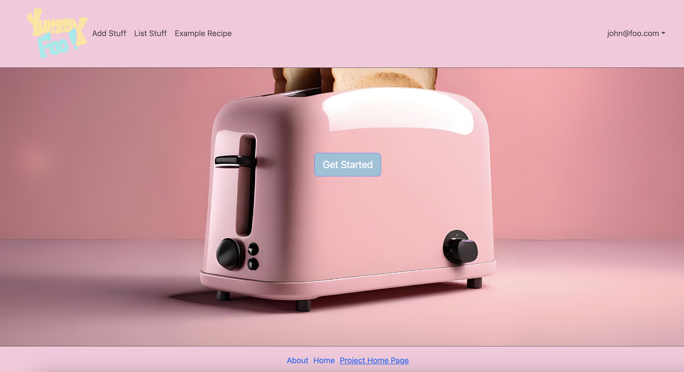
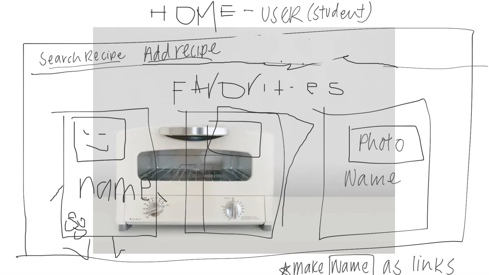
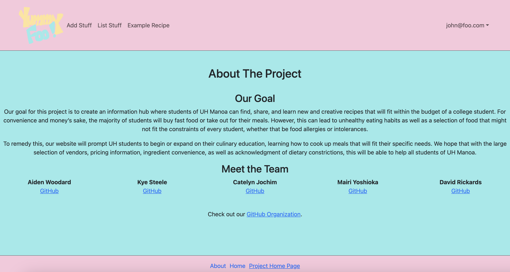
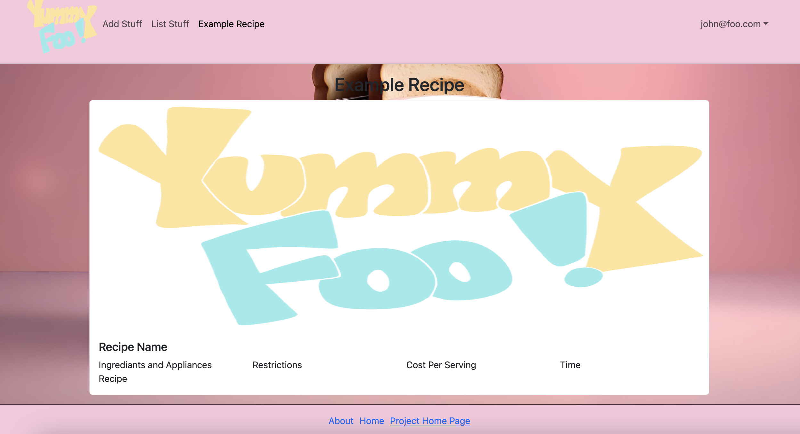
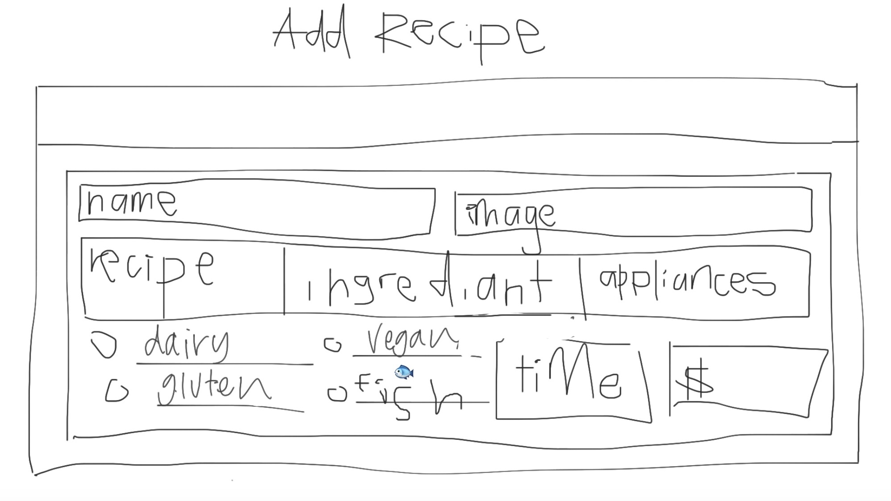

# Goal
Our goal for this project is to create an information hub where students of UH Manoa can find, share and learn new and creative recipes that will fit within the budget of a college student. For convenience and money’s sake, the majority of students will buy fast food or take out for their meals. However, this can lead to unhealthy eating habits as well as a selection of food that might not fit the constraints of every student, whether that be food allergies or intolerances. 

To remedy this, our website will prompt UH students to begin or expand on their culinary education, learning how to cook up meals that will fit their specific needs. We hope that with the large selection of vendors, pricing information, ingredient convenience, as well as acknowledgement of dietary constrictions, this will be able to help all students of UH Manoa.

## Link To...
  * [Team Contract](https://docs.google.com/document/d/10fjiUGCcoZn1zsEntLvA_btXFST54v0s46QtEraBu4E/edit?usp=sharing)
  * [GitHub Organization](https://github.com/eat-sleep-fortnite-repeat/eat-sleep-fortnite-repeat.github.io)
  * [Milestone 1 Project Page](https://github.com/orgs/eat-sleep-fortnite-repeat/projects/2)
  * [Milestone 2 Project Page](https://github.com/orgs/eat-sleep-fortnite-repeat/projects/3)

## M1 Pages So Far

### Landing Page

### User Homepage 

### About Us Page

### Recipe Page

### Add Recipe Page

## Deployment
Find our project website [here](http://143.110.144.132/)!
    
