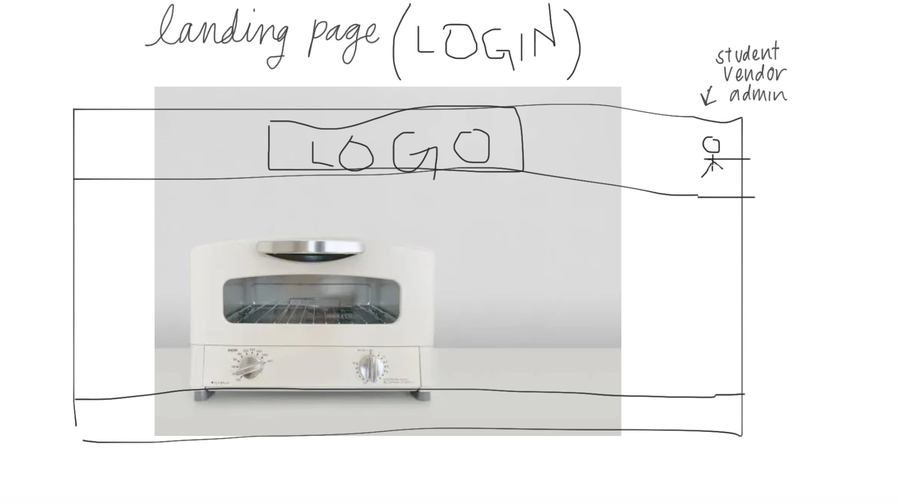
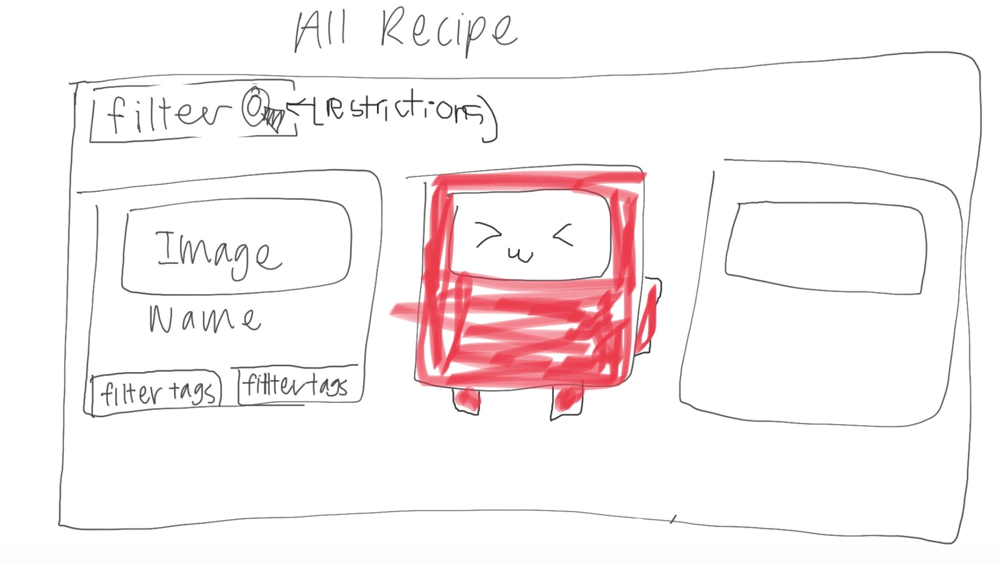
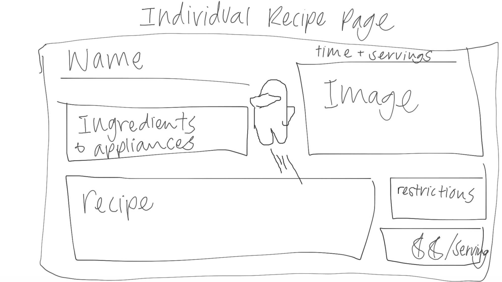

Our goal for this project is to create an information hub where students of UH Manoa can find, share and learn new and creative recipes that will fit within the budget of a college student. For convenience and money’s sake, the majority of students will buy fast food or take out for their meals. However, this can lead to unhealthy eating habits as well as a selection of food that might not fit the constraints of every student, whether that be food allergies or intolerances. 

To remedy this, our website will prompt UH students to begin or expand on their culinary education, learning how to cook up meals that will fit their specific needs. We hope that with the large selection of vendors, pricing information, ingredient convenience, as well as acknowledgement of dietary constrictions, this will be able to help all students of UH Manoa.

## Link To...
  * [Team Contract](https://docs.google.com/document/d/10fjiUGCcoZn1zsEntLvA_btXFST54v0s46QtEraBu4E/edit?usp=sharing)
  * [GitHub Organization](https://github.com/eat-sleep-fortnite-repeat/eat-sleep-fortnite-repeat.github.io)
  * [Milestone 1 Project Page](https://github.com/orgs/eat-sleep-fortnite-repeat/projects/2)

## M1: Mockups

### Landing Page

### User Homepage 

### Search Recipe Page

### Recipe Page

### Add Recipe Page

    
## What our system will provide

  * A standard directory layout using 'imports/' as recommended in the [Meteor Guide](https://guide.meteor.com/structure.html)
  * [Bootstrap 5 React](https://react-bootstrap.github.io/) for user interface.
  * [Uniforms](https://uniforms.tools/) for form development.
  * [alanning:roles](https://github.com/alanning/meteor-roles) to implement a special "Admin" user.
  * Authorization, authentication, and registration using built-in Meteor packages.
  * Initialization of users and data from a settings file.
  * Alerts regarding success or failure of DB updates using [Sweet Alert](https://sweetalert.js.org/).
  * Quality assurance using [ESLint](http://eslint.org) with packages to partially enforce the [Meteor Coding Standards](https://guide.meteor.com/code-style.html) and the [AirBnB Javascript Style Guide](https://github.com/airbnb/javascript).

The goal of this template is to help you get quickly started doing Meteor development by providing a reasonable directory structure for development and deployment, a set of common extensions to the core framework, and boilerplate code to implement basic page display, navigation, forms, roles, and collection manipulation.

To keep this codebase simple and small, some important capabilities are intentionally excluded from this template:

  * Unit Testing.
  * Security (meteor-application-template-react enables the insecure packages)
  * Deployment

Examples of the these capabilities will be provided elsewhere.

