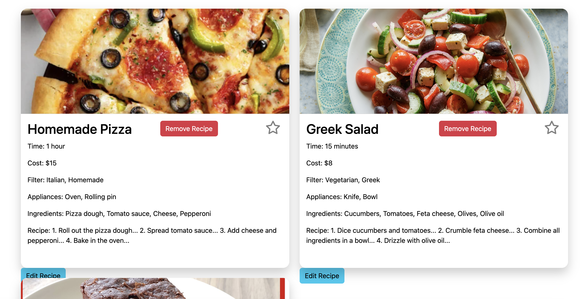
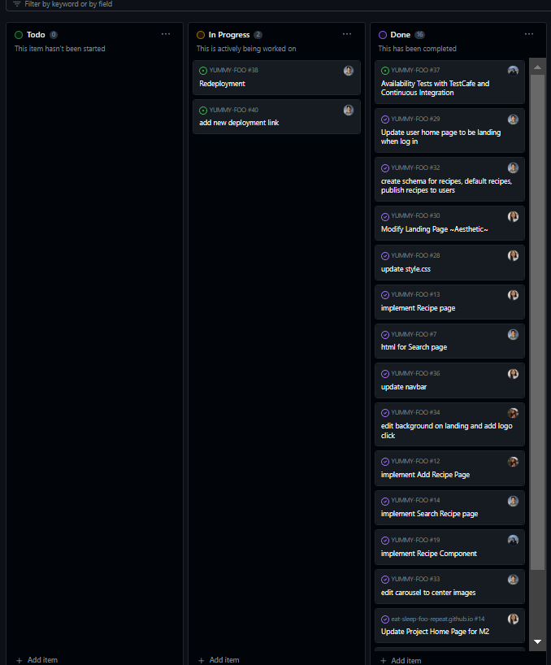
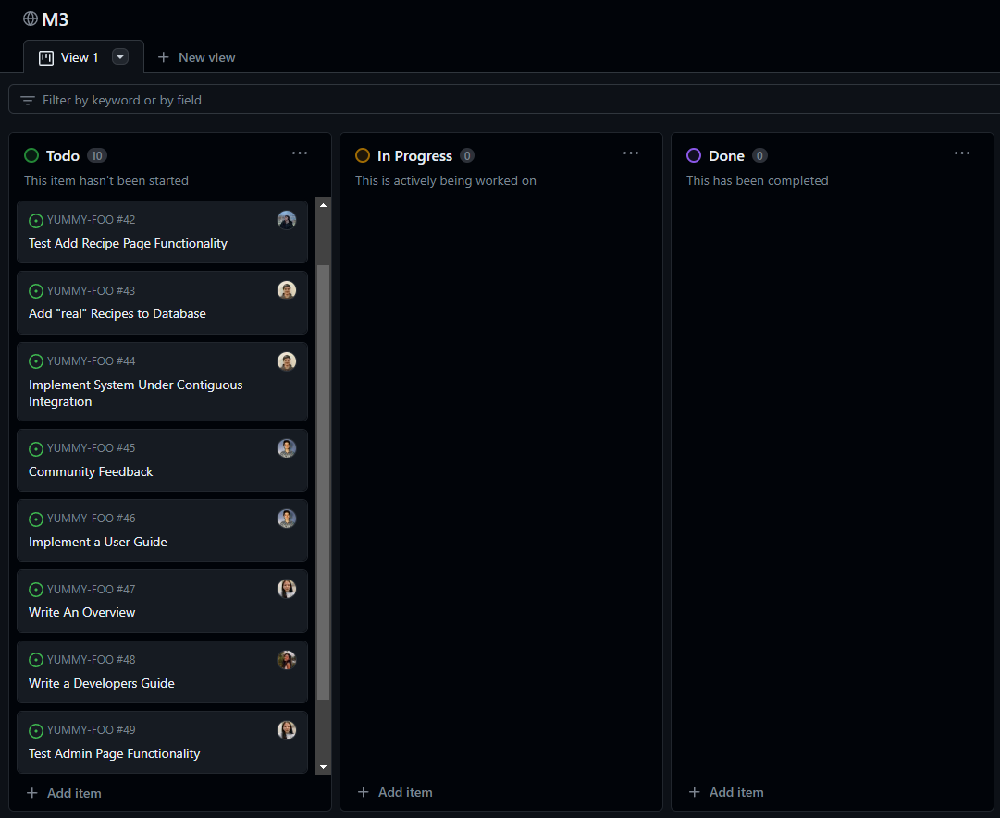

# Goal
Our goal for this project is to create an information hub where students of UH Manoa can find, share and learn new and creative recipes that will fit within the budget of a college student. For convenience and money’s sake, the majority of students will buy fast food or take out for their meals. However, this can lead to unhealthy eating habits as well as a selection of food that might not fit the constraints of every student, whether that be food allergies or intolerances. 

To remedy this, our website will prompt UH students to begin or expand on their culinary education, learning how to cook up meals that will fit their specific needs. We hope that with the large selection of vendors, pricing information, ingredient convenience, as well as acknowledgement of dietary constrictions, this will be able to help all students of UH Manoa.

## Link To...
  * [Team Contract](https://docs.google.com/document/d/10fjiUGCcoZn1zsEntLvA_btXFST54v0s46QtEraBu4E/edit?usp=sharing)
  * [GitHub Organization](https://github.com/eat-sleep-fortnite-repeat/eat-sleep-fortnite-repeat.github.io)
  * [Milestone 1 Project Page](https://github.com/orgs/eat-sleep-fortnite-repeat/projects/2)
  * [Milestone 2 Project Page](https://github.com/orgs/eat-sleep-fortnite-repeat/projects/3)
  * [Milestone 3 Project Page](https://github.com/orgs/eat-sleep-fortnite-repeat/projects/5/views/1)

## Developer Guide

### Download

### Installation
First, [install Meteor](https://www.meteor.com/install).

Second, once you have access to the Digits repo you can [download a copy of the project](https://github.com/mair1/digits).

Third, once you have the project set up in a program like IntelliJ IDEA, you can open up the terminal inside the application, cd into the app/ directory and run:
```
$ meteor npm install
```
Fourth, to actually run the website use:
```
$ meteor npm run start
```
* This segment might take a while to finish but you will know its done when this pops up: 
* This created the users that you can log into to access certain pages along with the default recipes built into the website
* It also contains the link you can click on to open the website

Fifth, as a precautionary check you can run:
```
$ meteor npm run start
```
to see if there are any errors, hopefully there won't be any and you can run the website without any issue

## User Guide

### Landing Page
Upon loading the website users are directed towards our landing page. Along with a carousel, this page gives a description to users about our purpose behind creating this website and how they can use it.


### Login
Next users should login or create an account in order to gain access to the websites main features.


### User Homepage / Favorites
Once logged in users are then taken to a Favorites page which includes all of their favorites recipes. A new user would have a blank page and can add to their favorites by navigating to Search.


### Search
The search page allows users to search by any part of the recipe whether that be name, time, ingredients, or cost. From the results they end up with users can then click on either click on the name or picture to take them to that specific recipe page.


### Specific Recipe Pages
This is the recipe page that includes all details about the specific recipe.


### Add Recipe
From Favorites and also the navbar users can also navigate to the Add Recipe page where they can upload their own recipe by filling in all the form text fields and then uploading an image from their local device.


### List Recipe Admin
For admins only, they are able to see all recipes and have the power to remove and edit any recipe.


### Edit Recipe Admin
If admin clicks on edit they are given a pop up where they can change any details about the recipe and update it for all users.


### About Us Page


## Testing
In the test directory there are tests to ensure site pages display and function as they should.


## Deployment
Find our project website [here](http://146.190.161.129/)!

## Development History
The development process for Yummy Foo conformed to [Issue Driven Project Management](https://courses.ics.hawaii.edu/ics314f19/modules/project-management/)! practices. In a nutshell:

* Development consists of a sequence of Milestones.
* Each Milestone is specified as a set of tasks.
* Each task is described using a GitHub Issue, and is assigned to a single developer to complete. 
* Tasks should typically consist of work that can be completed in 2-4 days. 
* The work for each task is accomplished with a git branch named “issue-XX”, where XX is replaced by the issue number. 
* When a task is complete, its corresponding issue is closed and its corresponding git branch is merged into master. 
* The state (todo, in progress, complete) of each task for a milestone is managed using a GitHub Project Board.

The following section documents the development history of Yummy Foo.

### Milestone 1: Mockup development
The goal of Milestone 1 was to create a set of HTML pages providing a mockup of the pages in the system.

Milestone 1 was managed using [Eat-Sleep-Foo-Repeat GitHub Project Board M1](https://github.com/orgs/eat-sleep-fortnite-repeat/projects/2/views/1):


### Milestone 2: Implementing Admin and list pages
The goal of Milestone 2 was to add more pages and tidy up the project as a whole.

Milestone 2 was managed using [Eat-Sleep-Foo-Repeat GitHub Project Board M2](https://github.com/orgs/eat-sleep-fortnite-repeat/projects/3/views/1):


### Milestone 3: Work in Progress
The goal of Milestone 3 is to finish implementing real data, the rest of the site, and get outside trial and feedback.

Milestone 3 will be managed using [Eat-Sleep-Foo-Repeat GitHub Project Board M3](https://github.com/orgs/eat-sleep-fortnite-repeat/projects/5):


## Team

Yummy Foo is designed, implemented, and maintained by [Aiden Woodard](https://github.com/aidenlkw), [Catelyn Jochim](https://github.com/cjochim), [David Rickards](https://github.com/DavidRickards), [Kye Steele](https://github.com/kyesteele), and [Mairi Yoshioka](https://github.com/mair1). 
